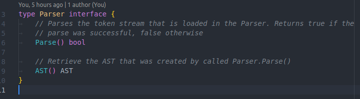
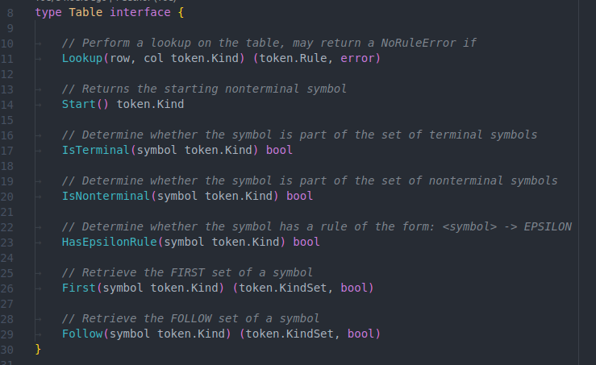
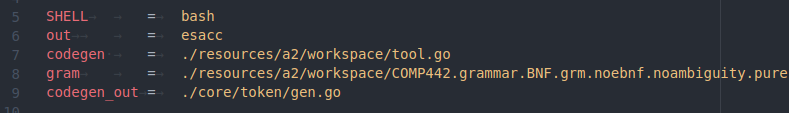
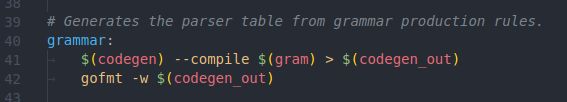
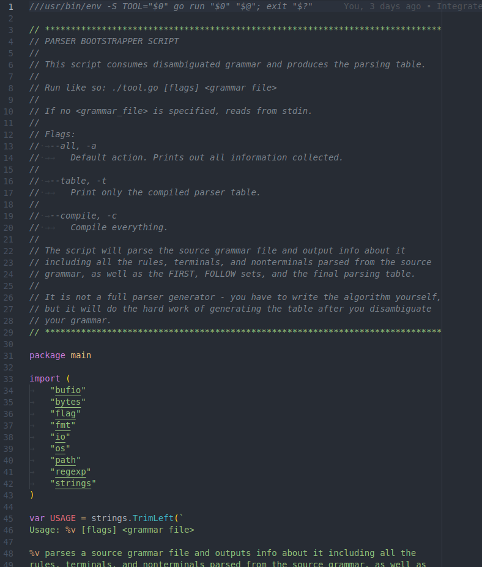

# ASSIGNMENT 2 - SYNTAX ANALYZER (PARSER)

**_Ethan Benabou_**

**_ID: 40032543_**

## 1 - LL(1) Grammar

```plaintext
<START> ::= <prog>
<prog> ::= <rept-prog0>

<rept-prog0> ::= <structOrImplOrFunc> <rept-prog0>
<rept-prog0> ::= EPSILON

<structOrImplOrFunc> ::= <structDecl>
<structOrImplOrFunc> ::= <implDef>
<structOrImplOrFunc> ::= <funcDef>

<structDecl> ::= 'struct' 'id' <opt-structDecl2> '{' <rept-structDecl4> '}' ';'
<rept-structDecl4> ::= <visibility> <memberDecl> <rept-structDecl4>
<rept-structDecl4> ::= EPSILON
<opt-structDecl2> ::= 'inherits' 'id' <rept-opt-structDecl22>
<opt-structDecl2> ::= EPSILON
<rept-opt-structDecl22> ::= ',' 'id' <rept-opt-structDecl22>
<rept-opt-structDecl22> ::= EPSILON

<implDef> ::= 'impl' 'id' '{' <rept-implDef3> '}'
<rept-implDef3> ::= <funcDef> <rept-implDef3>
<rept-implDef3> ::= EPSILON

<funcDef> ::= <funcHead> <funcBody>
<funcBody> ::= '{' <rept-funcBody1> '}'

<visibility> ::= 'public'
<visibility> ::= 'private'

<memberDecl> ::= <funcDecl>
<memberDecl> ::= <varDecl>

<funcDecl> ::= <funcHead> ';'
<funcHead> ::= 'func' 'id' '(' <fParams> ')' '->' <returnType>
<rept-funcBody1> ::= <varDeclOrStat> <rept-funcBody1>
<rept-funcBody1> ::= EPSILON

<varDeclOrStat> ::= <varDecl>
<varDeclOrStat> ::= <statement>

<varDecl> ::= 'let' 'id' ':' <type> <rept-varDecl4> ';'
<rept-varDecl4> ::= <arraySize> <rept-varDecl4>
<rept-varDecl4> ::= EPSILON

<statement> ::= <assignStatOrFuncCall>
<statement> ::= 'if' '(' <relExpr> ')' 'then' <statBlock> 'else' <statBlock> ';'
<statement> ::= 'while' '(' <relExpr> ')' <statBlock> ';'
<statement> ::= 'read' '(' <variable> ')' ';'
<statement> ::= 'write' '(' <expr> ')' ';'
<statement> ::= 'return' '(' <expr> ')' ';'

<assignStatOrFuncCall> ::= 'id' <assignStatOrFuncCall-disambiguate>

<assignStatOrFuncCall-disambiguate> ::= <indice> <more-indice> <more-assign>
<assignStatOrFuncCall-disambiguate> ::= '(' <aParams> ')' <more-func>
<assignStatOrFuncCall-disambiguate> ::= <more-assign>

<more-assign> ::= '.' <assignStatOrFuncCall>
<more-assign> ::= <assignOp> <expr> ';'

<more-func> ::= '.' <assignStatOrFuncCall>
<more-func> ::= ';'

<indice> ::= '[' <arithExpr> ']'

<varOrFuncCall> ::= 'id' <varOrFuncCall-disambiguate>

<varOrFuncCall-disambiguate> ::= '(' <aParams> ')' <another>
<varOrFuncCall-disambiguate> ::= <indice> <more-indice> <another>
<varOrFuncCall-disambiguate> ::= <another>

<more-indice> ::= <indice> <more-indice>
<more-indice> ::= EPSILON

<another> ::= '.' <varOrFuncCall>
<another> ::= EPSILON

<variable> ::= 'id' <more-indice> <something>

<something> ::= '.' <varOrFuncCall> 'id' <more-indice>
<something> ::= EPSILON

<functionCall> ::= 'id' '(' <aParams> ')' <something-func>
<something-func> ::= '.' <varOrFuncCall> 'id' '(' <aParams> ')'
<something-func> ::= EPSILON

<factor> ::= <varOrFuncCall>
<factor> ::= 'intNum'
<factor> ::= 'floatNum'
<factor> ::= '(' <arithExpr> ')'
<factor> ::= 'not' <factor>
<factor> ::= <sign> <factor>

<assignStat> ::= <variable> <assignOp> <expr>

<statBlock> ::= '{' <rept-statBlock1> '}'
<statBlock> ::= <statement>
<statBlock> ::= EPSILON

<rept-statBlock1> ::= <statement> <rept-statBlock1>
<rept-statBlock1> ::= EPSILON

<expr> ::= <arithExpr> <arithOrRelExpr-disambiguate>

<arithOrRelExpr-disambiguate> ::= <relOp> <arithExpr>
<arithOrRelExpr-disambiguate> ::= EPSILON

<relExpr> ::= <arithExpr> <relOp> <arithExpr>
<arithExpr> ::= <term> <rightrec-arithExpr>

<rightrec-arithExpr> ::= <addOp> <term> <rightrec-arithExpr>
<rightrec-arithExpr> ::= EPSILON

<sign> ::= '+'
<sign> ::= '-'
<term> ::= <factor> <rightrec-term>

<rightrec-term> ::= <multOp> <factor> <rightrec-term>
<rightrec-term> ::= EPSILON

<arraySize> ::= '[' <arraySize-factorized>
<arraySize-factorized> ::= ']'
<arraySize-factorized> ::= 'intNum' ']'

<returnType> ::= <type>
<returnType> ::= 'void'

<fParams> ::= 'id' ':' <type> <rept-fParams3> <rept-fParams4>
<fParams> ::= EPSILON
<rept-fParams3> ::= <arraySize> <rept-fParams3>
<rept-fParams3> ::= EPSILON
<rept-fParams4> ::= <fParamsTail> <rept-fParams4>
<rept-fParams4> ::= EPSILON

<aParams> ::= <expr> <rept-aParams1>
<aParams> ::= EPSILON
<rept-aParams1> ::= <aParamsTail> <rept-aParams1>
<rept-aParams1> ::= EPSILON
<fParamsTail> ::= ',' 'id' ':' <type> <rept-fParamsTail4>
<rept-fParamsTail4> ::= <arraySize> <rept-fParamsTail4>
<rept-fParamsTail4> ::= EPSILON
<aParamsTail> ::= ',' <expr>

<assignOp> ::= '='

<relOp> ::= 'eq'
<relOp> ::= 'neq'
<relOp> ::= 'lt'
<relOp> ::= 'gt'
<relOp> ::= 'leq'
<relOp> ::= 'geq'

<addOp> ::= '+'
<addOp> ::= '-'
<addOp> ::= 'or'

<multOp> ::= '*'
<multOp> ::= '/'
<multOp> ::= 'and'

<type> ::= 'integer'
<type> ::= 'float'
<type> ::= 'id'
```

## 2 - FIRST and FOLLOW sets

### _FIRST_ Set

```plaintext
FIRST(<funcHead>) = {'func'}
FIRST('then') = {'then'}
FIRST('+') = {'+'}
FIRST(<statement>) = {'id', 'if', 'while', 'read', 'write', 'return'}
FIRST(<varDecl>) = {'let'}
FIRST('void') = {'void'}
FIRST('inherits') = {'inherits'}
FIRST(<rept-implDef3>) = {'func', EPSILON}
FIRST(<relOp>) = {'geq', 'eq', 'neq', 'lt', 'gt', 'leq'}
FIRST(<more-assign>) = {'.', '='}
FIRST('/') = {'/'}
FIRST('if') = {'if'}
FIRST(<aParams>) = {'+', '-', EPSILON, 'id', 'intNum', 'floatNum', '(', 'not'}
FIRST(<assignOp>) = {'='}
FIRST(<prog>) = {'struct', 'impl', 'func', EPSILON}
FIRST(<rept-statBlock1>) = {'write', 'return', EPSILON, 'id', 'if', 'while', 'read'}
FIRST('lt') = {'lt'}
FIRST('write') = {'write'}
FIRST('public') = {'public'}
FIRST('struct') = {'struct'}
FIRST('not') = {'not'}
FIRST(<fParamsTail>) = {','}
FIRST('{') = {'{'}
FIRST(<statBlock>) = {'return', EPSILON, '{', 'id', 'if', 'while', 'read', 'write'}
FIRST('.') = {'.'}
FIRST(<something-func>) = {'.', EPSILON}
FIRST(<rightrec-arithExpr>) = {'-', 'or', EPSILON, '+'}
FIRST(<assignStatOrFuncCall>) = {'id'}
FIRST('geq') = {'geq'}
FIRST('id') = {'id'}
FIRST(<structOrImplOrFunc>) = {'struct', 'impl', 'func'}
FIRST('float') = {'float'}
FIRST(',') = {','}
FIRST('}') = {'}'}
FIRST('func') = {'func'}
FIRST(<funcDecl>) = {'func'}
FIRST(<rept-structDecl4>) = {'public', 'private', EPSILON}
FIRST('floatNum') = {'floatNum'}
FIRST('->') = {'->'}
FIRST(<rept-varDecl4>) = {'[', EPSILON}
FIRST(<rept-prog0>) = {'struct', 'impl', 'func', EPSILON}
FIRST(<varDeclOrStat>) = {'while', 'read', 'write', 'return', 'let', 'id', 'if'}
FIRST(<rept-fParamsTail4>) = {'[', EPSILON}
FIRST(<arraySize>) = {'['}
FIRST(';') = {';'}
FIRST(<relExpr>) = {'not', '+', '-', 'id', 'intNum', 'floatNum', '('}
FIRST(<rept-funcBody1>) = {EPSILON, 'let', 'id', 'if', 'while', 'read', 'write', 'return'}
FIRST('while') = {'while'}
FIRST(<opt-structDecl2>) = {'inherits', EPSILON}
FIRST(<visibility>) = {'public', 'private'}
FIRST(<variable>) = {'id'}
FIRST('neq') = {'neq'}
FIRST('integer') = {'integer'}
FIRST(<fParams>) = {'id', EPSILON}
FIRST(<funcDef>) = {'func'}
FIRST('return') = {'return'}
FIRST('impl') = {'impl'}
FIRST('let') = {'let'}
FIRST(<assignStat>) = {'id'}
FIRST(<more-indice>) = {'[', EPSILON}
FIRST(']') = {']'}
FIRST(<expr>) = {'id', 'intNum', 'floatNum', '(', 'not', '+', '-'}
FIRST(<START>) = {'struct', 'impl', 'func', EPSILON}
FIRST(<addOp>) = {'+', '-', 'or'}
FIRST(<arithExpr>) = {'floatNum', '(', 'not', '+', '-', 'id', 'intNum'}
FIRST(':') = {':'}
FIRST('leq') = {'leq'}
FIRST(<assignStatOrFuncCall-disambiguate>) = {'.', '=', '[', '('}
FIRST(<another>) = {'.', EPSILON}
FIRST(<rept-aParams1>) = {',', EPSILON}
FIRST(<indice>) = {'['}
FIRST(')') = {')'}
FIRST('gt') = {'gt'}
FIRST('private') = {'private'}
FIRST('eq') = {'eq'}
FIRST(<returnType>) = {'integer', 'float', 'id', 'void'}
FIRST(<varOrFuncCall>) = {'id'}
FIRST(<implDef>) = {'impl'}
FIRST(<rept-fParams3>) = {'[', EPSILON}
FIRST(<functionCall>) = {'id'}
FIRST(<structDecl>) = {'struct'}
FIRST(<aParamsTail>) = {','}
FIRST(<term>) = {'(', 'not', '+', '-', 'id', 'intNum', 'floatNum'}
FIRST(<sign>) = {'+', '-'}
FIRST(<rept-fParams4>) = {',', EPSILON}
FIRST(<something>) = {EPSILON, '.'}
FIRST(<rightrec-term>) = {'*', '/', 'and', EPSILON}
FIRST(<varOrFuncCall-disambiguate>) = {EPSILON, '(', '[', '.'}
FIRST('-') = {'-'}
FIRST(<type>) = {'integer', 'float', 'id'}
FIRST(<more-func>) = {'.', ';'}
FIRST('[') = {'['}
FIRST('intNum') = {'intNum'}
FIRST(<arraySize-factorized>) = {']', 'intNum'}
FIRST(<factor>) = {'id', 'intNum', 'floatNum', '(', 'not', '+', '-'}
FIRST('=') = {'='}
FIRST('and') = {'and'}
FIRST(<arithOrRelExpr-disambiguate>) = {'neq', 'lt', 'gt', 'leq', 'geq', EPSILON, 'eq'}
FIRST(<multOp>) = {'and', '*', '/'}
FIRST('else') = {'else'}
FIRST('or') = {'or'}
FIRST(EPSILON) = {EPSILON}
FIRST(<memberDecl>) = {'let', 'func'}
FIRST(<funcBody>) = {'{'}
FIRST('*') = {'*'}
FIRST(<rept-opt-structDecl22>) = {',', EPSILON}
FIRST('read') = {'read'}
FIRST('(') = {'('}
```

### _FOLLOW_ Set

```plaintext
FOLLOW('lt') = {'(', 'not', 'floatNum', 'id', '+', 'intNum', '-'}
FOLLOW('=') = {'not', 'id', '(', '+', '-', 'floatNum', 'intNum'}
FOLLOW('neq') = {'+', 'id', 'not', 'floatNum', '(', 'intNum', '-'}
FOLLOW('private') = {'let', 'func'}
FOLLOW(<memberDecl>) = {'private', 'public', '}'}
FOLLOW('id') = {'+', '-', 'let', 'id', 'if', 'neq', 'eq', ';', '}', 'lt', ']', 'geq', ',', '{', 'struct', '/', '*', '[', 'while', 'private', '(', '.', '=', 'inherits', 'leq', 'or', 'gt', ':', 'read', 'write', 'public', 'return', 'and', ')', 'impl', 'func'}
FOLLOW('}') = {'struct', 'func', ';', 'impl', '}'}
FOLLOW('inherits') = {'id'}
FOLLOW(<funcHead>) = {';', '{'}
FOLLOW('write') = {'('}
FOLLOW(<rept-statBlock1>) = {'}'}
FOLLOW(<factor>) = {')', '*', 'neq', '+', ']', '/', 'lt', 'and', 'gt', ';', 'leq', 'geq', 'eq', '-', 'or', ','}
FOLLOW('func') = {'id'}
FOLLOW(')') = {'neq', 'read', 'or', '.', ']', 'geq', ',', 'write', 'if', '}', '->', '+', '/', 'and', 'let', 'eq', 'lt', 'return', ';', 'leq', 'id', ')', 'then', 'while', '{', '-', 'gt', '*'}
FOLLOW(<funcBody>) = {'impl', 'struct', '}', 'func'}
FOLLOW(<returnType>) = {';', '{'}
FOLLOW(<functionCall>) = {}
FOLLOW(<funcDecl>) = {'public', 'private', '}'}
FOLLOW(<implDef>) = {'impl', 'struct', 'func'}
FOLLOW(<term>) = {',', 'neq', 'or', 'gt', ')', '+', 'geq', 'eq', 'leq', 'lt', ']', ';', '-'}
FOLLOW(<rept-structDecl4>) = {'}'}
FOLLOW('floatNum') = {'and', ',', 'neq', ';', '/', 'leq', 'or', '+', 'eq', ')', 'gt', 'geq', '-', '*', 'lt', ']'}
FOLLOW('geq') = {'(', '-', 'intNum', 'not', 'floatNum', '+', 'id'}
FOLLOW(<more-assign>) = {'}', 'if', 'write', 'return', 'id', 'while', 'let', ';', 'read'}
FOLLOW(<variable>) = {'=', ')'}
FOLLOW(<funcDef>) = {'}', 'struct', 'func', 'impl'}
FOLLOW('[') = {'floatNum', 'not', 'id', '(', ']', '+', '-', 'intNum'}
FOLLOW('intNum') = {'gt', ')', '+', ';', 'lt', 'or', '*', 'eq', 'leq', 'and', ',', 'neq', '/', ']', '-', 'geq'}
FOLLOW(<rept-funcBody1>) = {'}'}
FOLLOW(<varOrFuncCall>) = {'*', 'id', '+', 'lt', '-', ')', 'or', ']', ',', 'leq', 'neq', 'geq', 'eq', '/', 'gt', 'and', ';'}
FOLLOW(<rept-fParams3>) = {',', ')'}
FOLLOW('+') = {'(', 'id', 'not', 'floatNum', '-', '+', 'intNum'}
FOLLOW('and') = {'id', '+', 'floatNum', 'intNum', '-', '(', 'not'}
FOLLOW(<assignStatOrFuncCall-disambiguate>) = {'write', 'return', 'while', ';', 'let', '}', 'if', 'id', 'read'}
FOLLOW(<more-func>) = {'return', 'if', 'read', 'write', ';', 'while', 'let', '}', 'id'}
FOLLOW('.') = {'id'}
FOLLOW(<arithExpr>) = {';', 'gt', 'geq', 'eq', 'leq', ']', 'neq', ')', ',', 'lt'}
FOLLOW(<START>) = {}
FOLLOW(<rept-prog0>) = {}
FOLLOW(<statBlock>) = {';'}
FOLLOW(<fParamsTail>) = {')', ','}
FOLLOW('else') = {'}', 'read', 'id', ';', '{', 'while', 'if', 'return', 'let', 'write'}
FOLLOW('eq') = {'intNum', '-', '(', 'not', '+', 'floatNum', 'id'}
FOLLOW(<expr>) = {',', ';', ')'}
FOLLOW(<something-func>) = {}
FOLLOW(<addOp>) = {'intNum', '-', 'floatNum', 'id', '(', 'not', '+'}
FOLLOW('struct') = {'id'}
FOLLOW(<something>) = {')', '='}
FOLLOW(<another>) = {'and', 'gt', ',', 'lt', 'or', 'leq', 'neq', 'geq', '/', '-', '*', ']', ';', ')', 'id', '+', 'eq'}
FOLLOW(<more-indice>) = {'or', '+', '/', 'id', ')', 'gt', 'neq', ';', '=', 'lt', 'eq', '-', '*', 'geq', 'leq', ']', 'and', '.', ','}
FOLLOW(<aParams>) = {')'}
FOLLOW(<structOrImplOrFunc>) = {'struct', 'impl', 'func'}
FOLLOW(']') = {'.', 'lt', 'write', '+', ';', '}', 'gt', ']', '[', ')', '*', 'and', 'neq', 'or', 'if', 'let', 'read', 'eq', '/', 'id', '-', 'while', 'leq', 'geq', ',', '=', 'return'}
FOLLOW(<fParams>) = {')'}
FOLLOW('gt') = {'intNum', 'not', '-', 'id', '+', '(', 'floatNum'}
FOLLOW(<assignStatOrFuncCall>) = {'}', ';', 'write', 'return', 'id', 'while', 'let', 'read', 'if'}
FOLLOW('/') = {'intNum', 'id', 'floatNum', '-', '+', '(', 'not'}
FOLLOW('or') = {'not', 'floatNum', '-', 'id', 'intNum', '+', '('}
FOLLOW('integer') = {'public', 'id', 'return', '}', 'private', 'let', ',', '[', '{', 'write', ';', 'if', 'read', ')', 'while'}
FOLLOW(<rept-varDecl4>) = {';'}
FOLLOW('{') = {'if', 'private', ';', 'while', 'func', 'return', 'public', 'impl', 'id', 'read', '}', 'write', 'struct', 'let'}
FOLLOW(',') = {'id', '(', 'intNum', 'floatNum', '+', 'not', '-'}
FOLLOW('return') = {'('}
FOLLOW('void') = {'{', ';'}
FOLLOW('impl') = {'id'}
FOLLOW(<arithOrRelExpr-disambiguate>) = {')', ';', ','}
FOLLOW(';') = {'read', 'func', 'return', ';', 'private', '}', 'impl', 'let', 'write', 'struct', 'id', 'public', 'if', 'while'}
FOLLOW('leq') = {'(', '+', 'id', 'intNum', 'not', 'floatNum', '-'}
FOLLOW(EPSILON) = {'-', 'id', ')', '}', '/', '*', 'lt', ',', 'gt', 'eq', 'and', 'neq', 'leq', '{', ';', 'or', 'geq', ']', '+', '=', '.'}
FOLLOW(<prog>) = {}
FOLLOW(<visibility>) = {'let', 'func'}
FOLLOW(<statement>) = {'read', 'write', 'return', ';', 'while', '}', 'id', 'if', 'let'}
FOLLOW(<rightrec-arithExpr>) = {'leq', ']', ';', 'neq', ',', 'geq', 'lt', ')', 'eq', 'gt'}
FOLLOW(<multOp>) = {'-', 'floatNum', '+', 'intNum', '(', 'id', 'not'}
FOLLOW(<varOrFuncCall-disambiguate>) = {'eq', 'leq', '-', ',', 'neq', 'lt', ')', 'id', ';', 'or', ']', 'and', '*', 'gt', '+', '/', 'geq'}
FOLLOW(<assignOp>) = {'intNum', '-', 'id', 'floatNum', '(', '+', 'not'}
FOLLOW(':') = {'integer', 'float', 'id'}
FOLLOW(<rept-implDef3>) = {'}'}
FOLLOW(<varDeclOrStat>) = {'if', 'let', 'read', 'write', 'id', 'return', 'while', '}'}
FOLLOW(<indice>) = {'lt', 'read', 'return', 'eq', ',', 'neq', '+', '*', 'write', 'leq', '-', '/', '=', 'id', 'and', 'gt', 'if', ';', ']', 'geq', 'while', '[', ')', 'let', '.', 'or', '}'}
FOLLOW(<arraySize-factorized>) = {',', ';', '[', ')'}
FOLLOW('let') = {'id'}
FOLLOW('then') = {'if', '}', 'let', 'return', 'id', ';', 'write', '{', 'while', 'read'}
FOLLOW('if') = {'('}
FOLLOW(<relOp>) = {'(', 'intNum', 'not', 'floatNum', 'id', '-', '+'}
FOLLOW(<rept-aParams1>) = {')'}
FOLLOW(<rept-fParamsTail4>) = {')', ','}
FOLLOW(<rightrec-term>) = {',', '-', ')', '+', ';', 'neq', 'or', 'gt', 'geq', 'lt', 'leq', 'eq', ']'}
FOLLOW(<assignStat>) = {}
FOLLOW('read') = {'('}
FOLLOW('*') = {'id', 'not', '+', '(', '-', 'floatNum', 'intNum'}
FOLLOW('-') = {'-', 'intNum', 'id', 'not', '+', '(', 'floatNum'}
FOLLOW(<arraySize>) = {',', ';', '[', ')'}
FOLLOW(<sign>) = {'+', '-', 'intNum', 'id', '(', 'not', 'floatNum'}
FOLLOW('while') = {'('}
FOLLOW(<type>) = {'let', 'id', ';', '{', 'read', 'if', 'return', 'write', '}', 'private', ',', '[', ')', 'while', 'public'}
FOLLOW(<varDecl>) = {'}', 'private', 'let', 'while', 'id', 'public', 'write', 'read', 'return', 'if'}
FOLLOW('public') = {'func', 'let'}
FOLLOW(<opt-structDecl2>) = {'{'}
FOLLOW(<structDecl>) = {'impl', 'func', 'struct'}
FOLLOW(<aParamsTail>) = {')', ','}
FOLLOW(<rept-fParams4>) = {')'}
FOLLOW('not') = {'floatNum', '(', 'not', 'id', 'intNum', '+', '-'}
FOLLOW(<rept-opt-structDecl22>) = {'{'}
FOLLOW(<relExpr>) = {')'}
FOLLOW('float') = {'write', ')', ',', 'id', '{', 'read', 'private', '}', 'public', 'return', 'let', ';', 'if', '[', 'while'}
FOLLOW('->') = {'integer', 'id', 'void', 'float'}
FOLLOW('(') = {'eq', 'while', 'write', '+', 'gt', 'leq', ',', 'not', 'geq', '{', '}', 'intNum', ']', 'neq', '-', 'floatNum', 'return', 'if', 'or', '/', '*', 'lt', '(', ';', 'let', 'read', 'and', ')', 'id'}
```

## 3 - Design

This design is a table-driven parser.

The parser is implemented in Golang and the main module is called:
`github.com/obonobo/esac`.

The design is very similar to how the scanner was written in assignment 1. I
begun the implementation by designing a set of small but powerful interfaces and
data types for my components:

- PACKAGE: `github.com/obonobo/esac/core/parser`

  - `Parser` interface
  - `AST` struct

- PACKAGE: `github.com/obonobo/esac/core/tabledrivenparser`

  - This package contains an implementation of the `Parser` interface from the
    previous package.
  - `Table` interface

- PACKAGE: `github.com/obonobo/esac/core/tabledrivenparser/compositetable`

  - This package contains an implementation of the `Table` interface from the
    previous package.

**_`Parser` interface_**



**_`Table` interface_**



The Parser accepts any object that implements the `Table` interface shown above.
This makes it modular - it is possible to replace the table entirely and reuse
the same parser algorithm.

Another important component is the table generator tool: `tool.go`. This is a
script that I wrote to generate the parser table (in Go code) from the grammar
production rules. It implements the algorithms for determining the FIRST and
FOLLOW sets. Using those sets, it constructs the parser table.

In my `Makefile`, I wrote a target that runs the tool:





It spits out a `gen.go` in the `github.com/obonobo/esac/core/token` package. The
constants produced by `tool.go` are then used in the `compositetable` package.

**_`tool.go` Sample:_**



Using `tool.go` really saved me a lot of time iterating.

## 4 - Use of Tools

- `tool.go`: written by me for this project
- GitHub Actions for running my CI while I develop
- `grammartool.jar`: I used this at the beginning to verify that my I was
  producing the LL(1) grammar correctly - but I did the transformations by hand.
