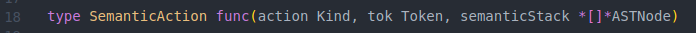
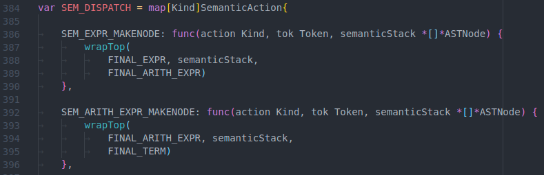
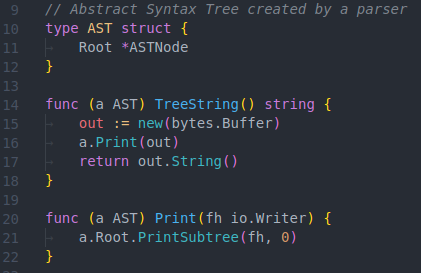
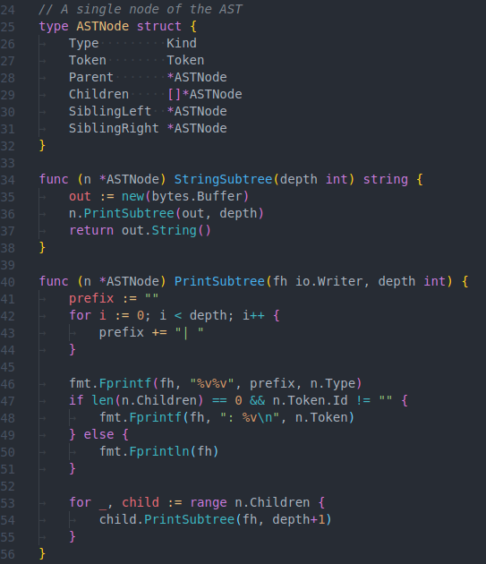

# Assignment 3 - Abstract Syntax Tree (AST) Generation

**_Ethan Benabou_**

**_ID: 40032543_**

## 1 - Attribute Grammar and Semantic Actions

The grammar from Assignment 2 was modified by adding semantic actions symbols in
key locations on the right-hand sides of certain production rules.

The format of the semantic actions is as follows:

```plaintext
(SEM-ACTION) ::= Description. All semantic actions are prefixed by "SEM-" and surrounded by () parentheses.
```

### 1.1 - Semantic Actions

```plaintext
(SEM-ASSIGN-MAKEFAMILY) ::= Make an "Assign" subtree

(SEM-FACTOR-MAKENODE) ::= Make a "Factor" node

(SEM-INTEGER-MAKENODE) ::= Make a "Factor" node

(SEM-FUNC-BODY-MAKEFAMILY) ::= Make a "Body" subtree

(SEM-MULT-MAKENODE) ::= Make a "*" node

(SEM-WHILE-MAKEFAMILY) ::= Make a "While" subtree

(SEM-RETURN-MAKEFAMILY) ::= Make a "Return" subtree

(SEM-FCALL-MAKENODE) ::= Make a "FuncCall" subtree

(SEM-ARITH-EXPR-MAKENODE) ::= Make an "ArithExpr" subtree

(SEM-REPT-PROG0-MAKESIBLING) ::= Attach a "FuncDef", "StructDecl", or "ImplDef" to a list of program elements.

(SEM-STRUCT-DECL-MAKEFAMILY) ::= Make a "StructDecl" subtree

(SEM-EXPR-MAKENODE) ::= Make an "Expr" subtree

(SEM-VAR-DECL-MAKEFAMILY) ::= Make a "VarDecl" subtree

(SEM-FPARAM-LIST-MAKEFAMILY) ::= Make a "ParamList" subtree

(SEM-FLOAT-MAKENODE) ::= Make a "Float" data type node

(SEM-VOID-MAKENODE) ::= Make a "Void" node

(SEM-TYPE-MAKEFAMILY) ::= Make a "Type" subtree, this wraps an IntNum, FloatNum, etc.

(SEM-STATEMENT-MAKEFAMILY) ::= Make a "Statement" subtree, wraps the different kinds of statements

(SEM-WRITE-MAKEFAMILY) ::= Make a "Write" kind of statement subtree

(SEM-PROG-MAKE-NODE) ::= Make a "Prog" tree

(SEM-IMPL-DEF-MAKEFAMILY) ::= Make a "ImplDef" subtree

(SEM-INTNUM-MAKENODE) ::= Make a "IntNum" literal node

(SEM-FLOATNUM-MAKENODE) ::= Make a "FloatNum" literal node

(SEM-FUNC-DEF-MAKEFAMILY) ::= Make a "FuncDef" subtree

(SEM-READ-MAKEFAMILY) ::= Make a "Read" kind of statement subtree

(SEM-FPARAM-MAKEFAMILY) ::= Make a "Param" subtree

(SEM-FUNC-CALL-MAKEFAMILY) ::= Make a "FuncCall" subtree

(SEM-TERM-MAKENODE) ::= Make a "Term" node

(SEM-REPT-PROG0-MAKEEPSILON) ::= Noop, doesn't do anything

(SEM-ID-MAKENODE) ::= Make a "ID" node

(SEM-IF-MAKEFAMILY) ::= Make a "If" kind of statement

(SEM-MULT-MAKEFAMILY) ::= Make a "Mult" operation subtree
```

### 1.2 - Attribute Grammar

```plaintext
<START> ::= <prog>
<prog> ::= <rept-prog0> (PROG-MAKE-NODE)
<rept-prog0> ::= <structOrImplOrFunc> (REPT-PROG0-MAKESIBLING) <rept-prog0>
<rept-prog0> ::= EPSILON (REPT-PROG0-MAKEEPSILON)

<structOrImplOrFunc> ::= <structDecl> (STRUCT-DECL-MAKEFAMILY)
<structOrImplOrFunc> ::= <implDef> (IMPL-DEF-MAKEFAMILY)
<structOrImplOrFunc> ::= <funcDef> (FUNC-DEF-MAKEFAMILY)

<structDecl> ::= 'struct' 'id' (ID-MAKENODE) <opt-structDecl2> '{' <rept-structDecl4> '}' ';'

<rept-structDecl4> ::= <visibility> <memberDecl> <rept-structDecl4>
<rept-structDecl4> ::= EPSILON
<opt-structDecl2> ::= 'inherits' 'id' (ID-MAKENODE) <rept-opt-structDecl22>
<opt-structDecl2> ::= EPSILON
<rept-opt-structDecl22> ::= ',' 'id' (ID-MAKENODE) <rept-opt-structDecl22>
<rept-opt-structDecl22> ::= EPSILON
<implDef> ::= 'impl' 'id' (ID-MAKENODE) '{' <rept-implDef3> '}'
<rept-implDef3> ::= <funcDef> <rept-implDef3>
<rept-implDef3> ::= EPSILON
<funcDef> ::= <funcHead> <funcBody>
<funcBody> ::= '{' <rept-funcBody1> '}'
<visibility> ::= 'public'
<visibility> ::= 'private'
<memberDecl> ::= <funcDecl>
<memberDecl> ::= <varDecl>
<funcDecl> ::= <funcHead> ';'
<funcHead> ::= 'func' 'id' (ID-MAKENODE) '(' <fParams> ')' '->' <returnType>
<rept-funcBody1> ::= <varDeclOrStat> (FUNC-BODY-MAKEFAMILY) <rept-funcBody1>
<rept-funcBody1> ::= EPSILON (FUNC-BODY-MAKEFAMILY)

<varDeclOrStat> ::= <varDecl> (VAR-DECL-MAKEFAMILY)
<varDeclOrStat> ::= <statement> (STATEMENT-MAKEFAMILY)

<varDecl> ::= 'let' 'id' (ID-MAKENODE) ':' <type> <rept-varDecl4> ';'
<rept-varDecl4> ::= <arraySize> <rept-varDecl4>
<rept-varDecl4> ::= EPSILON

<statement> ::= <assignStatOrFuncCall>
<statement> ::= 'if' '(' <relExpr> ')' 'then' <statBlock> 'else' <statBlock> ';' (IF-MAKEFAMILY)
<statement> ::= 'while' '(' <relExpr> ')' <statBlock> ';' (WHILE-MAKEFAMILY)
<statement> ::= 'read' '(' <variable> ')' ';' (READ-MAKEFAMILY)
<statement> ::= 'write' '(' <expr> ')' ';' (WRITE-MAKEFAMILY)
<statement> ::= 'return' '(' <expr> ')' ';' (RETURN-MAKEFAMILY)

<assignStatOrFuncCall> ::= 'id' (ID-MAKENODE) <assignStatOrFuncCall-disambiguate>

<assignStatOrFuncCall-disambiguate> ::= <indice> <more-indice> <more-assign>
<assignStatOrFuncCall-disambiguate> ::= '(' <aParams> ')' <more-func>
<assignStatOrFuncCall-disambiguate> ::= <more-assign>

<more-assign> ::= '.' <assignStatOrFuncCall>
<more-assign> ::= <assignOp> <expr> ';' (ASSIGN-MAKEFAMILY)

<more-func> ::= '.' <assignStatOrFuncCall>
<more-func> ::= ';' (FUNC-CALL-MAKEFAMILY)

<indice> ::= '[' <arithExpr> ']' (DIM-MAKENODE) (DIMLIST-MAKEFAMILY)

<varOrFuncCall> ::= 'id' (ID-MAKENODE) <varOrFuncCall-disambiguate> (VAR-OR-FUNC-CALL-UP)

<varOrFuncCall-disambiguate> ::= '(' <aParams> ')' (FCALL-MAKENODE) <another>
<varOrFuncCall-disambiguate> ::= <indice> <more-indice> <another>
<varOrFuncCall-disambiguate> ::= <another>

<more-indice> ::= <indice> <more-indice>
<more-indice> ::= EPSILON

<another> ::= '.' <varOrFuncCall>
<another> ::= EPSILON


<variable> ::= 'id' (ID-MAKENODE) <more-indice> <something>
<something> ::= '.' <varOrFuncCall> 'id' (ID-MAKENODE) <more-indice>
<something> ::= EPSILON

<functionCall> ::= 'id' (ID-MAKENODE) '(' <aParams> ')' <something-func>
<something-func> ::= '.' <varOrFuncCall> 'id' (ID-MAKENODE) '(' <aParams> ')'
<something-func> ::= EPSILON

<factor> ::= <varOrFuncCall> (FACTOR-UP)
<factor> ::= 'intNum' (INTNUM-MAKENODE)
<factor> ::= 'floatNum' (FLOATNUM-MAKENODE)
<factor> ::= '(' <arithExpr> ')'
<factor> ::= 'not' <factor>
<factor> ::= <sign> <factor>

<assignStat> ::= <variable> <assignOp> <expr>

<statBlock> ::= '{' <rept-statBlock1> '}'
<statBlock> ::= <statement>
<statBlock> ::= EPSILON
<rept-statBlock1> ::= <statement> <rept-statBlock1>
<rept-statBlock1> ::= EPSILON

<expr> ::= <arithExpr> <arithOrRelExpr-disambiguate>

<arithOrRelExpr-disambiguate> ::= <relOp> <arithExpr>
<arithOrRelExpr-disambiguate> ::= EPSILON (EXPR-MAKENODE)

<relExpr> ::= <arithExpr> <relOp> <arithExpr>
<arithExpr> ::= <term> (TERM-MAKENODE) <rightrec-arithExpr> (ARITH-EXPR-MAKENODE)
<rightrec-arithExpr> ::= <addOp> <term> <rightrec-arithExpr>
<rightrec-arithExpr> ::= EPSILON
<sign> ::= '+'
<sign> ::= '-'
<term> ::= <factor> (FACTOR-MAKENODE) <rightrec-term>

<rightrec-term> ::= <multOp> <factor> (MULT-MAKEFAMILY) <rightrec-term>
<rightrec-term> ::= EPSILON

<arraySize> ::= '[' <arraySize-factorized>
<arraySize-factorized> ::= ']'
<arraySize-factorized> ::= 'intNum' ']'

<returnType> ::= <type>
<returnType> ::= 'void' (VOID-MAKENODE) (TYPE-MAKEFAMILY)
<fParams> ::= 'id' (ID-MAKENODE) ':' <type> (TYPE-MAKEFAMILY) <rept-fParams3> (FPARAM-MAKEFAMILY) (FPARAM-LIST-MAKEFAMILY) <rept-fParams4>
<fParams> ::= EPSILON (FPARAM-LIST-MAKEFAMILY)
<rept-fParams3> ::= <arraySize> <rept-fParams3>
<rept-fParams3> ::= EPSILON
<rept-fParams4> ::= <fParamsTail> <rept-fParams4>
<rept-fParams4> ::= EPSILON
<aParams> ::= <expr> <rept-aParams1>
<aParams> ::= EPSILON
<rept-aParams1> ::= <aParamsTail> <rept-aParams1>
<rept-aParams1> ::= EPSILON
<fParamsTail> ::= ',' 'id' (ID-MAKENODE) ':' <type> (TYPE-MAKEFAMILY) <rept-fParamsTail4> (FPARAM-MAKEFAMILY) (FPARAM-LIST-MAKEFAMILY)
<rept-fParamsTail4> ::= <arraySize> <rept-fParamsTail4>
<rept-fParamsTail4> ::= EPSILON
<aParamsTail> ::= ',' <expr>
<assignOp> ::= '='
<relOp> ::= 'eq'
<relOp> ::= 'neq'
<relOp> ::= 'lt'
<relOp> ::= 'gt'
<relOp> ::= 'leq'
<relOp> ::= 'geq'
<addOp> ::= '+'
<addOp> ::= '-'
<addOp> ::= 'or'

<multOp> ::= '*' (MULT-MAKENODE)
<multOp> ::= '/' (MULT-MAKENODE)
<multOp> ::= 'and' (MULT-MAKENODE)

<type> ::= 'integer' (INTEGER-MAKENODE)
<type> ::= 'float' (FLOAT-MAKENODE)
<type> ::= 'id' (ID-MAKENODE)
```

## 2 - Design

### Changes

Building on assignment 2, the following code changes have been made:

- A new subcommand `parse` for the CLI, usage: `esac parse [-o output] [input files]`

- Semantic actions support in the `tool.go` codegen script that was created in
  Assignment 2. The tool now generates an extra code file `core/token/ast.go`,
  which contains the AST data structure itself as well as function stubs for
  semantic actions. All other code depends on generated code + stubs, so the
  only thing needed after running the tool is to fill in the semantic action
  function stubs.

- Semantic action support in `CompositeTable` struct
  (`core/tabledrivenparser/composi`)

- Improved error handling for `TableDrivenParser`, I added some new error types
  with better error messages

- More tests for `TableDrivenParser`

- Semantic action support for `TableDrivenParser`. The changes made include:
  - Semantic stack to complement the parsing stack
  - A new branch in `TableDrivenParser.Parse()` for handling semantic actions.
    The `core/token/ast.go` file (generated by `tool.go`) has a generated
    function that decides if a symbol is a semantic action. The
    `TableDrivenParser` invokes this method, thereby keeping these components
    separate and modular.
  - A method `TableDrivenParser.executeSemanticAction()` that gets injected with
    the semantic stack + other information. This data is passed to the semantic
    action dispatcher generated by `tool.go` in `ast.go`.

### Semantic Dispatch Map

The most important part of the design is the `token.SEM_DISPATCH` map. This map
associates semantic action symbols with semantic action functions. All the
semantic action functions have the same signature:



And then the mapping is done like so:



As you can see, the dispatch functions accept relevant parameters including the
semantic stack itself, which can be freely manipulated in any way by the
semantic action.

Most semantic actions will push new nodes onto the semantic stack, but some
actions will pop one or more nodes and collapse them into subtrees, which are
themselves pushed on the stack.

This dispatch map allows the `TableDrivenParser` to execute semantic actions in
response to semantic symbols hidden in the grammar with very little modification
to the parser. All that the parser needs to do is keep the semantic stack and
then throw any semantic symbols into the dispatcher, who decides how to modify
the stack.

### Abstract Syntax Tree

Two new types were created for the AST: type `AST` which holds a pointer to the
root ast node, and type `ASTNode` which represents the actual tree and subtrees,
recursively.

**_type `AST`:_**



<div style="page-break-after: always;"></div>

**_type `ASTNode`_**



I chose the strategy of creating a generic AST data structure. Rather than
creating "subclasses" for each type of node, the `ASTNode` contains a
`ASTNode.Type` field which describes which kind of node it is (e.g. `FuncCall`,
`ArithExpr`, etc.) and then the node can have 0-n children.

<!-- This design is a table-driven parser.

The parser is implemented in Golang and the main module is called:
`github.com/obonobo/esac`.

The design is very similar to how the scanner was written in assignment 1. I
begun the implementation by designing a set of small but powerful interfaces and
data types for my components:

- PACKAGE: `github.com/obonobo/esac/core/parser`

  - `Parser` interface
  - `AST` struct

- PACKAGE: `github.com/obonobo/esac/core/tabledrivenparser`

  - This package contains an implementation of the `Parser` interface from the
    previous package.
  - `Table` interface

- PACKAGE: `github.com/obonobo/esac/core/tabledrivenparser/compositetable`

  - This package contains an implementation of the `Table` interface from the
    previous package.

**_`Parser` interface_**


**_`Table` interface_**


The Parser accepts any object that implements the `Table` interface shown above.
This makes it modular - it is possible to replace the table entirely and reuse
the same parser algorithm.

Another important component is the table generator tool: `tool.go`. This is a
script that I wrote to generate the parser table (in Go code) from the grammar
production rules. It implements the algorithms for determining the FIRST and
FOLLOW sets. Using those sets, it constructs the parser table.

In my `Makefile`, I wrote a target that runs the tool:


It spits out a `gen.go` in the `github.com/obonobo/esac/core/token` package. The
constants produced by `tool.go` are then used in the `compositetable` package.

**_`tool.go` Sample:_**


Using `tool.go` really saved me a lot of time iterating. -->

## 3 - Use of Tools

- `tool.go`: written by me for this project. This is a partial parser-generator
  that generates a large portion of the code used for the parser. Specifically,
  it creates the parse table, first, and follow sets, as well as code and
  function stubs used for the semantic actions of our attribute grammar.
