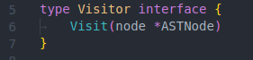
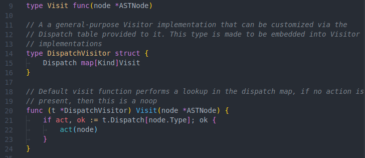
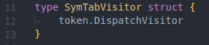
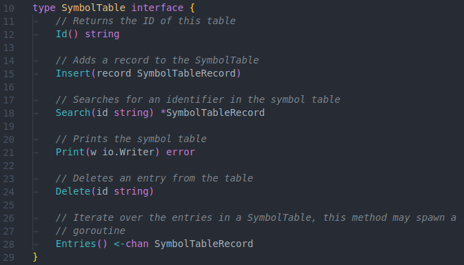
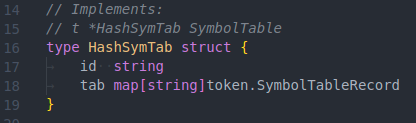
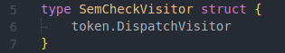

# Assignment 4 - Semantic Analysis

**_Ethan Benabou_**

**_ID: 40032543_**

## 1 - Semantic Rules

<!--
Section 1.   List of semantic rules implemented : Using the (1-15) itemized list provided below (see “Implementation”), provide
a checklist that identifies what semantic checks are either implemented or not implemented in your assignment.
 -->

Below is the full list of semantic rules that have been implemented by the
additions in this phase of the assignment.

**_Symbol Table Creation Phase_**

1. [x] Global scope symbol table.

2. [x] Individual symbol tables for each struct, impl, and top-level function.
       These tables are "nested" (linked to) from within their parent tables.
       E.g. the symbol table for struct `MyStruct` is linked to from the
       `MyStruct` entry in the global symbol table.

3. [x] Symbol table entries for each scope data member (e.g. struct data
       members, function-local variables).

4. [x] Function's define scopes with their own symbol table, these tables are
       linked to from the function's entry in a parent table.

5. [x] The symbol table creation phase emits errors + warnings for certain
       semantic errors. Including: duplicate identifiers, warnings for shadowed
       members.

6. [x] This phase also emits errors for declared but not defined functions, and
       defined but not declared functions.

7. [x] Symbol table printouts are supported.

8. [x] Errors are emitted for duplicate identifiers within the same scope.

9. [x] Warnings are emitted for function overloading.

**_Semantic Checking Phase (Binding and Type Checking)_**

10. [x] Expression, assignment, and return statement type checking is performed.

11. [x] Errors emitted for usage of scope-undefined identifiers.

12. [x] Function calls are type checked + number of parameters is checked, type
        checking of expressions used as function parameters is performed.

13. [x] Array dimensions lists are checked.

14. [x] Errors emitted for circular class dependencies.

15. [x] `.` operator checked for correct usage. This operator should only be
        used on variables of a struct type, and only to access valid members of
        this struct (fields or struct methods). If this described usage is not
        obeyed, errors are emitted from the is checking phase.

## 2 - Design

<!--
Section 2.   Design  :  I  –  Overall  design  –  Description/rationale  of  the  overall  structure  of  the  solution  and  the  roles  of  the
individual  components  used  in  the  applied  solution.  II  –  Phases  –  Description  of  the  purpose  of  each  semantic
checking phase involved in the implementation.
 -->

In this assignment, two post-parse semantic analysis phases are added to the
compiler. These phases are, as described by prof Pacquet, the **_Symbol Table
Creation Phase_** which traverses the AST datastructure emitted by the parser,
depth-first, and assembles symbol tables for every scope within the program.
This phase emits an annotated AST _intermediate representation_ which we will
call `SymAST`.

Also implemented is the **_Semantic Checking Phase_**, which consumes the
`SymAST` IR created by the symbol table creation phase. This phase executes
further semantic checks to ensure that basic language semantics are obeyed. In
particular, binding and type checking semantic actions are performed as the
`SymAST` is traversed. This phase emits an annotated SymAST _intermediate
representation_ which we will call `TypeSymAST`

With both of these phases implemented, the compiler processing pipeline is
roughly:

    source   -->   AST   -->   SymAST   -->   TypeSymAST
            PARSER      SYMBOL         TYPE
                        TABLE          CHECK
                        VISITOR        VISITOR

These phases are implemented via the _Visitor Pattern_ which is a good pattern
for traversing trees like the AST produced by our parser. A new interface, ``,
has been introduced:

The Visitors that implement these phases both derive from a common visitor
algorithm that is implemented by a new type called `DispatchVisitor`:

The `DispatchVisitor` implements the `Visitor.Visit()` method as a map lookup.
Specialized Visitors can extend the `DispatchVisitor` by populating its
`Dispatch` map, which defines semantic actions that should be taken upon
discovery of a specific type of `ASTNode`.

### PHASE 1 - _Symbol Table Creation Phase_

The **_Symbol Table Creation Phase_** phase is accomplished by extended the
`DispatchVisitor` through a new type called `SymTabVisitor`:

Here we are extending the Visitor through Go's built-in "embedded struct"
mechanism. The only thing that `SymTabVisitor` needs to tweak is to populate the
`Dispatch` map of the underlying `DispatchVisitor`. The Visitor fills this map
with semantic actions that annotate the AST with `SymbolTable` instances. The
`SymbolTable` interface defines methods for manipulating and searching a symbol
table:

It has a single concrete implementation in the form of the `HashSymTab`:

`SymbolTableRecords` may contain links to further symbol tables, which are
defined on identifiers within the scope of the current symbol table.

The `SymTabVisitor` can be injected with a Go channel (concurrent read/write
queue) upon which it will emit any errors and warnings encountered during the
AST traversal.

### PHASE 2 - _Semantic Checking Phase_

The **_Semantic Checking Phase_** is implemented by the `SemCheckVisitor`:

This phase works basically the same as the **_Symbol Table Creation Phase_**
described above. The `SemCheckVisitor` can be injected with a Go channel for
emitting errors and warnings, just like the `SymTabVisitor`.

## 3 - Use of Tools

<!--
Section 3.   Use of tools : Identify all the tools/libraries/techniques that you have used in your implementation and justify why
you have used these particular ones as opposed to others.
-->

- `tool.go`: written by me for this project. This is a partial parser-generator
  that generates a large portion of the code used for the parser. Specifically,
  it creates the parse table, first, and follow sets, as well as code and
  function stubs used for the semantic actions of our attribute grammar.
