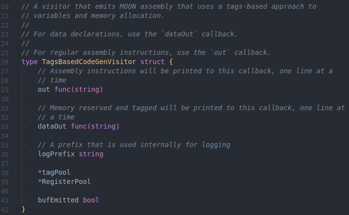
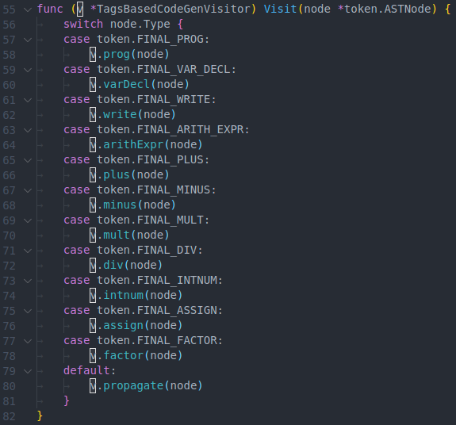
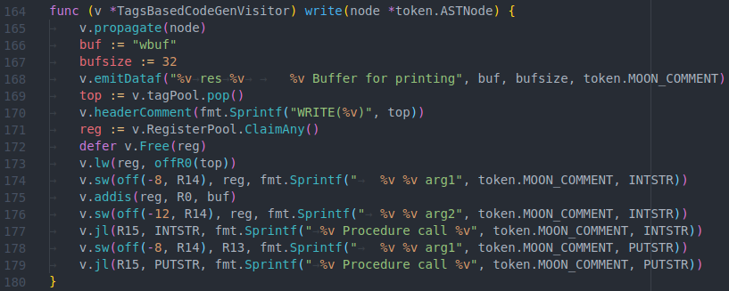
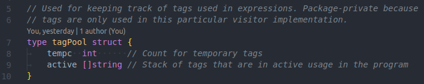
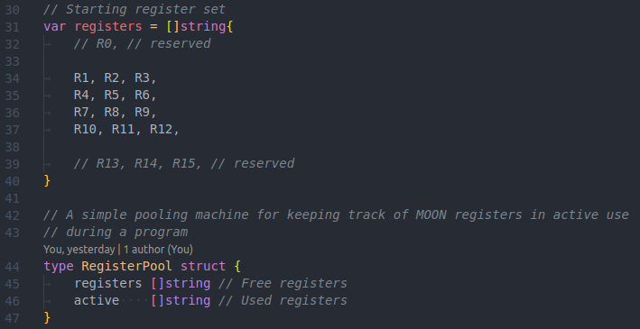

# Assignment 5 - Code Generation

**_Ethan Benabou_**

**_ID: 40032543_**

## 1 - Analysis

**_1. Memory Allocation:_**

1. [x] Allocate memory for basic types (integer, float).
2. [x] Allocate memory for arrays of basic types.
3. [x] Allocate memory for objects.
4. [x] Allocate memory for arrays of objects.

**_2. Functions:_**

1. [x] Branch to a function's code block, execute the code block, branch back to
       the calling function.
2. [ ] Pass parameters as local values to the function's code block.
3. [ ] Upon execution of a return statement, pass the return value back to the
       calling function.
4. [ ] Call to member functions that can use their object's data members.

**_3. Statements:_**

1. [x] Assignment statement: assignment of the resulting value of an expression
       to a variable, independently of what is the expression to the right of the
       assignment operator.
2. [x] Conditional statement: implementation of a branching mechanism.
3. [x] Loop statement: implementation of a branching mechanism.
4. [x] Input/output statement: execution of a keyboard input statement should
       result in the user being prompted for a value from the keyboard by the Moon
       program and assign this value to the parameter passed to the input statement.
       Execution of a console output statement should print to the Moon console the
       result of evaluating the expression passed as a parameter to the output
       statement

**_4. Aggregate data elements access:_**

1. [x] For arrays of basic types (integer and float), access to an array's
       elements.
2. [ ] For arrays of objects, access to an array's element's data members.
3. [ ] For objects, access to members of basic types.
4. [ ] For objects, access to members of array or object types.

**_5. Expressions:_**

1. [x] Computing the value of an entire complex expression.
2. [ ] Expression involving an array factor whose indexes are themselves
       expressions.
3. [ ] Expression involving an object factor referring to object members.

## 2 - Design

In this part of the project, we reuse the visitor infrastructure that we created
in the previous phase of the project. Visitors are components that are applied
to the our _intermediate representation (IR)_ to implement further processing
phases following the parse.

In the previous phase of the project, we extended our AST data structure to
support accepting visitor objects. This included adding symbol table annotations
to the AST nodes, as well as adding an `Accept` method to the AST node so that
each node can accept visitors. We also created two visitors: a symbol table
creation visitor, and a type checking visitor.

These two visitors implement the first two post-parse phases. In this part of
the project, we will implement one more visitor - the codegen visitor.

This visitor will traverse the AST using _Depth-First Search (DFS)_ and emit
moon assembly code along the way as nodes are processed.

We started this part of the project with a `TagsBasedCodeGenVisitor`. The
visitor emits simple tags-based assembly code where variables, including
temporary variables used to process expressions, are stored in tagged memory
areas reserved using the `res` moon instruction. This type of code is does not
support more advanced code features such as stack-based function execution, but
the advantage is that it is very simple to implement.

This is what the tags-based visitor looks like:

The `Visit` method of this visitor is called on every node in the AST; it
contains a switch statement that dispatches based on the type of the node being
processed:

The node-processing methods of the visitor emit simplified, tags-based code. For
example, here is an implementation of the `write` builtin function which writes
an expression to the console:

The visitor makes use of two important secondary components:

**_1. `tagPool`_**

An object that manages all the tags used to reserve memory.

**_2. `RegisterPool`_**

A simple pool object that keeps track of the available register of the moon
machine. When the visitor wants to use a register, it invokes its `RegisterPool`
to decide which register will be used. The register pool is aware of the 16
register of the moon machine. It keeps `r0`, `r15`, and `r14` reserved
for `0`, jump link, and the stack pointer respectively.

## 3 - Use of Tools

- `tool.go`: written by me for this project. This is a partial parser-generator
  that generates a large portion of the code used for the parser. Specifically,
  it creates the parse table, first, and follow sets, as well as code and
  function stubs used for the semantic actions of our attribute grammar.
